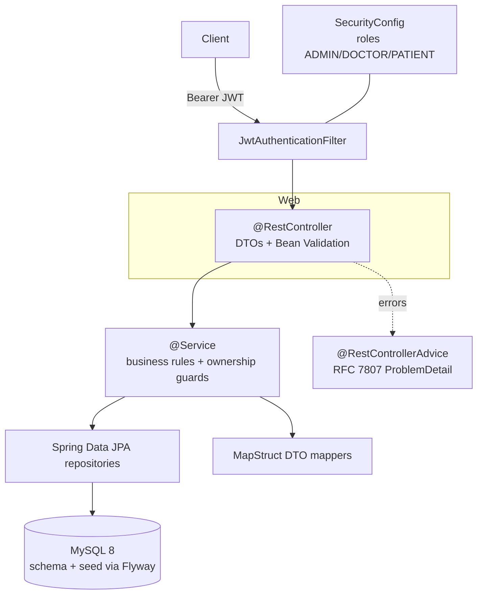

# 🏥 Hospital Management System

A production-shaped **REST API** for managing patients, doctors, appointments and
medical records — built with Spring Boot 3, Spring Data JPA, JWT security, Flyway
migrations and Testcontainers. This replaces an earlier console prototype; the
value here is the layered architecture, the enforced domain constraints, and the
role-based access control proven by tests.

- **Live Swagger UI:** https://hospital-app-production-1b19.up.railway.app/swagger-ui.html
  (demo login `alice` / `Password123!` — see [Demo credentials](#demo-credentials))
- **Stack:** Java 21 · Spring Boot 3.3 · Spring Data JPA · Spring Security (JWT) · MySQL 8 · Flyway · MapStruct · Testcontainers · Maven

> **Résumé accuracy note.** Data access is **Spring Data JPA** (not raw JDBC — the
> two are different approaches; this project uses JPA/Hibernate repositories). No
> "X% faster data retrieval" claim is made: there is no benchmarked baseline to
> compare against, so quoting a speedup would be unsupportable.

---

## What it demonstrates

- **Layered architecture:** Controller → Service → Repository, with DTOs at the
  boundary (entities are never exposed) and MapStruct for mapping.
- **Real domain constraints**, enforced at the database, not just in app code:
  - A doctor **cannot** hold two non-cancelled appointments in the same slot —
    a MySQL generated column `active_slot` + a unique index `(doctor_id, active_slot)`.
  - Appointments **cannot** be booked in the past (Bean Validation `@Future` + a
    service check).
  - Cancellation is a **soft delete** with an audit trail (`status=CANCELLED`,
    `cancelled_at`, `cancel_reason`); the freed slot becomes bookable again
    because `active_slot` is NULL for cancelled rows.
- **JWT security** with roles `ADMIN` / `DOCTOR` / `PATIENT`, and **ownership
  checks**: a patient can read only their own records — proven by a test.
- **RFC 7807 problem-detail** error responses via `@RestControllerAdvice`.
- Pagination + sorting on all list endpoints, Actuator health, OpenAPI docs.

## Architecture



## Run it (2 commands)

```bash
docker compose up --build        # starts MySQL + the app
open http://localhost:8080/swagger-ui.html
```

Flyway creates the schema and seeds demo data on first boot.

### Demo credentials

All seeded users share the password **`Password123!`**:

| Username | Role | Notes |
|---|---|---|
| `admin` | ADMIN | full access |
| `dr.smith` | DOCTOR | doctor #1 (Cardiology) |
| `dr.jones` | DOCTOR | doctor #2 (Dermatology) |
| `alice` | PATIENT | patient #1 (has a seeded record + appointment) |
| `bob` | PATIENT | patient #2 |

```bash
# get a token
curl -s -X POST localhost:8080/api/auth/login \
  -H 'Content-Type: application/json' \
  -d '{"username":"alice","password":"Password123!"}'
```

## API overview

| Method & path | Role | Purpose |
|---|---|---|
| `POST /api/auth/login` | public | obtain a JWT |
| `POST /api/auth/register` | public | patient self-registration |
| `POST /api/patients` · `GET /api/patients` | ADMIN | create / list patients |
| `GET /api/patients/{id}` | owner / staff | patient profile |
| `GET /api/patients/{id}/medical-records` | owner / staff | a patient's records |
| `POST /api/doctors` | ADMIN | create doctor |
| `GET /api/doctors` · `GET /api/doctors/{id}` | any auth | list / get doctors |
| `POST /api/appointments` | PATIENT / ADMIN | book (409 on clash, 400 if past) |
| `GET /api/appointments` | any auth | list, scoped to your role |
| `POST /api/appointments/{id}/cancel` | owner / staff | soft-delete cancel |
| `POST /api/medical-records` | DOCTOR | author a record |

## Verified behaviour

Exercised end-to-end against a real MySQL container (also covered by the
Testcontainers suite):

| Scenario | Result |
|---|---|
| Patient reads **their own** medical records | `200` |
| Patient reads **another patient's** records | `403` (RFC 7807 problem detail) |
| Book a slot the doctor already has | `409` (service check) |
| Re-book an identical free slot (race) | `409` (DB unique constraint) |
| Book in the past | `400` (validation) |
| Cancel, then re-book the freed slot | `200` then `201` |
| Unauthenticated request | `401` |
| Patient tries to create a doctor | `403` |

## Data model & key constraint

```sql
-- A doctor cannot double-book. active_slot is NULL for cancelled rows
-- (MySQL permits duplicate NULLs in a unique index), so a cancelled slot
-- is bookable again while an active one is not.
active_slot DATETIME(6) GENERATED ALWAYS AS
    (CASE WHEN status <> 'CANCELLED' THEN start_time ELSE NULL END) STORED,
CONSTRAINT uq_doctor_active_slot UNIQUE (doctor_id, active_slot)
```

## Testing

```bash
mvn verify
```

- **Unit tests (Mockito):** appointment conflict, past-date rejection, soft-delete
  cancellation, role-scoped listing — no Spring context, fast.
- **Integration tests (Testcontainers, real MySQL):** login, the
  patient-cannot-read-another-patient's-data proof, `409` conflict, `400` past
  booking, `401`/`403` authorization. Hibernate `ddl-auto=validate` also confirms
  the entities match the Flyway schema.

> The integration tests are annotated `@Testcontainers(disabledWithoutDocker = true)`,
> so they **skip** (not fail) on a machine without a Testcontainers-compatible
> Docker and **run** in CI, which ships one.

## Deploy

- **Railway / Render:** deploy the `Dockerfile`, attach a managed MySQL, and set
  `DB_URL`, `DB_USERNAME`, `DB_PASSWORD`, and a strong `APP_JWT_SECRET`. Flyway
  migrates on startup. Put the live `/swagger-ui.html` URL at the top of this README.
- **Local:** `docker compose up --build` (app + MySQL).

## License

MIT — see [LICENSE](LICENSE).
